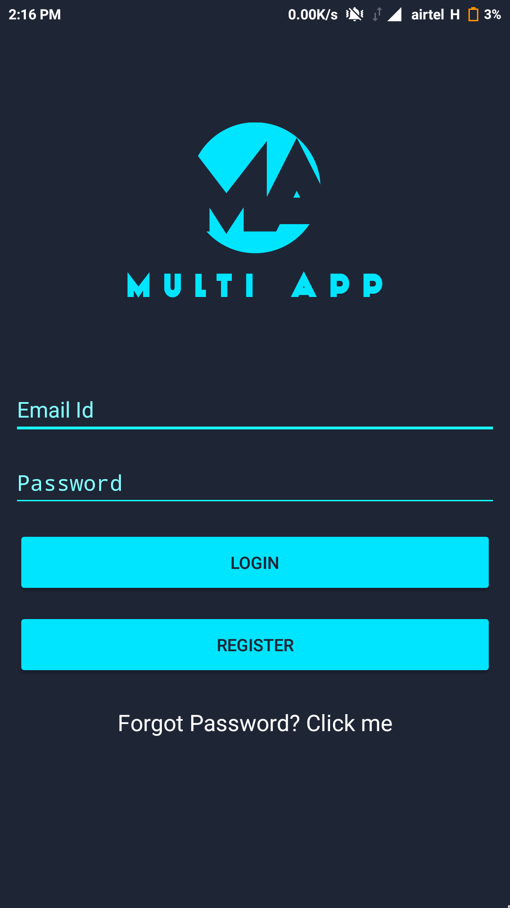
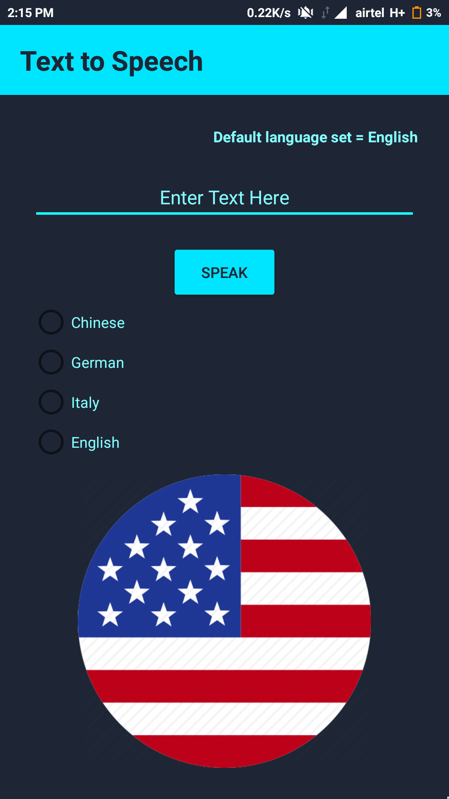
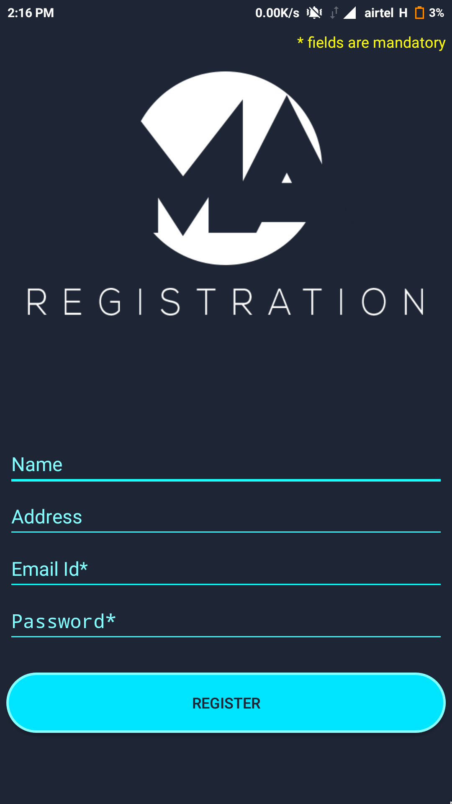
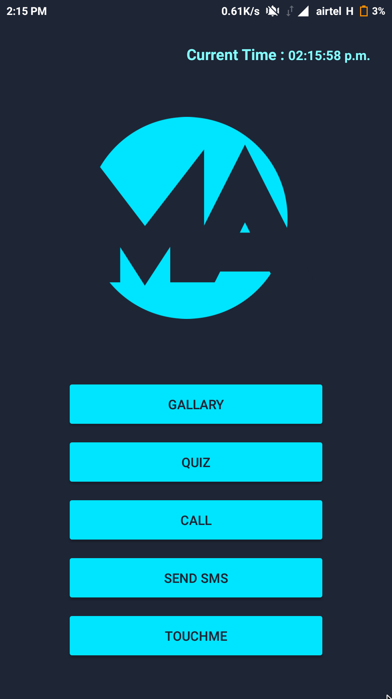

# Multi-App
An Android application that have functionality to convert text to speech in different languages , camera option, quizzes, call options, gallery and much more...

This project can be used to take snippets of the different functionality it provides.
Code thus has been written in a generalised format. 

<h2>Screen shots</h2>

<h2>Installation</h2>

Clone the project from github. Extract the file and import it in Android Studio.Compile it and Run

Completed Progress:
<progress value="96" max="100">
</progress>

<h2>Contributers</h2>

Barun Sarraf

E-Mail=barunsaraf1@gmail.com

  
